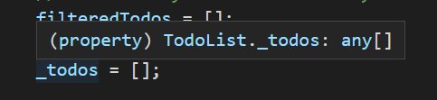
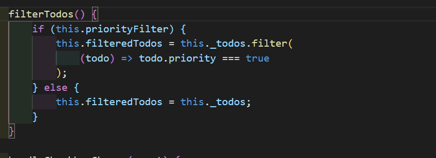
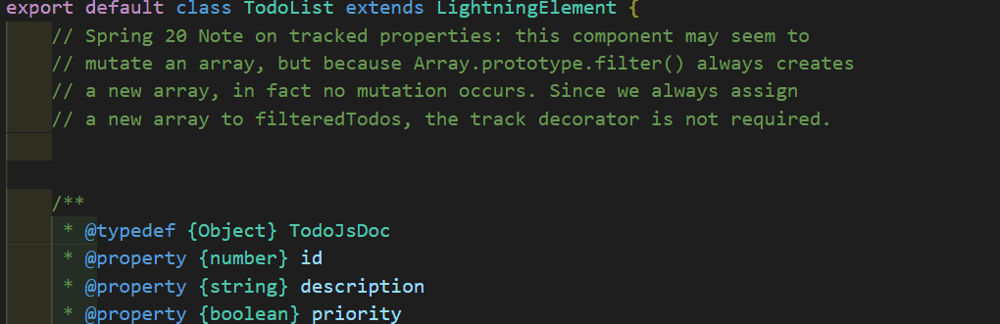
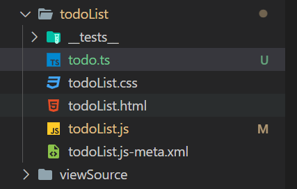
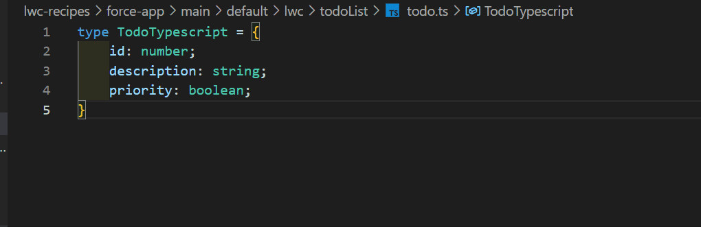
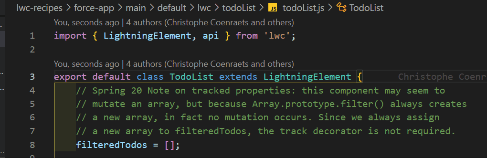

# Types with LWC components for better developer experience and code reliability

In this article we'll see how to use types with Salesforce's Lightning Web Components (LWC) in order to improve developer experience, productivity and code reliability. There are different ways to use types such as JSDoc, TypeScript, TypeScript with checks and TypeScript in strict mode, listed from the least constraining to the most constraining.

The more constraining ways offer more safety regarding bug checking but seemingly demand more work. It demands more effort when you write new code or a new type. But in the long run, every time you update code, you can rely on typing and the editor to warn you about errors and needed modifications. It means you don't have to provide the mental energy and time needed to check everywhere a variable is used to be sure the changes are non- breaking.

You can find a fork of the LWC
recipe with the modifications discussed in the article here: [Example Repository](https://github.com/GuillaumeBonnet/lwc-recipes/commit/63bcdd1b25c879caa7b4c8821989e85e9762387e)

## Weak auto-completion by default

When you write JavaScript, your code editor is able to provide some sort of auto-completion based on the code you previously wrote. It does not work very well with plain JavaScript and we will see how to improve that by modifying the [todoList.js](https://github.com/trailheadapps/lwc-recipes/blob/main/force-app/main/default/lwc/todoList/todoList.js) file from Salesforce's LWC recipes repository. We are using Visual Studio Code as our code editor, but other IDE also have similar features.

If you hover over the \_todos variable in the file, the IDE will tell you that it just knows the variable is an array of type any which can be anything.



When you use this variable as shown in the next GIF the editor doesn't tell you what property the element of the array has. You have to do the effort to look around how the array is initialized or passed down to the todoList component in order to know that the elements have for properties priority, description and id.



## JSDoc

[JSDoc](https://jsdoc.app/about-getting-started.html) tags are comments with a specific format that you add to your code and are parsed by tools to build documentation. For us, JSDoc are tags that are understood and used by the editor to assist us.

We add a tag to define the type TodoJsDoc and a tag to apply this type to the \_todos variable.

```javascript
/**
 * @typedef {Object} TodoJsDoc
 * @property {number} id
 * @property {string} description
 * @property {boolean} priority
 */

/** @type {TodoJsDoc[]} */
_todos = null;
```

The auto-completion is now possible as shown in the following GIF.



Once you defined a type in a file you can reuse it in other files. In our example we would reuse the type wherever the TodoList component is used to be certain that the data passed down with the todos attribute has the expected shape.

JSDoc types can match the needs of your project, but the tag syntax can be complicated to write. If you go down that road you might want to find a good JSDoc extension to help you.
In the next part we'll define types with Typescript, which is less verbose than JSDoc types.

## TypeScript and JSDoc

TypeScript (TS) is a popular language that is like a stricter, structured and typed JavaScript.
Projects that use this language have source files written in TypeScript and a build step to transpile the code into JavaScript. This build step doesn't fit Salesforce projects, but we can still use the power of TypeScript files, without changing our whole project structure, by defining types in TypeScript files and referencing those types in JSDoc tags.

To do that let's create the file todo.ts in its folder lwc-recipes\force-app\main\default\lwc\todoList\\.


The content defines the type with the TS syntax:

```typescript
type TodoTypescript = {
  id: number;
  description: string;
  priority: boolean;
  // TS syntax => variableOrPropertyName: Type;
};
```

Let's update the JSDoc tags to use this type:



We have the same functionality as with types defined with JSDoc, but I prefer the TypeScript method because it's easier and shorter to write.

## TypeScript check

Whether you define types with TS or JSDoc you can
configure your file so that the editor is stricter and checks for more errors.
To do so, add the comment `//@ts-check` at the beginning of your js files.

The following GIF shows that adding this comment checks for many errors such as a spelling error on a property. The error can now be fixed instead of going through and creating a bug at run time in production.



As you can see the downside is that it also triggers false positive errors for getters, setters and some imports. But I believe the safety you get from ts-check outweigh the drawbacks.

## Side notes

### deployment configuration

If there are deployment problems with the TypeScript files you need to exclude them from the deployment steps. With the sfdx plugin you can configure the .forceignore file to do so.

### sfdx plugin uses TypeScript internally

In the .sfdx folder in your project you can find \*.d.ts files which are TypeScript definition files generated by the sfdx plugin so that the editor has information about the standard LWC functions and modules imported in LWC files.
It is also used for the Apex auto-completion. The sfdx command "SFDX: Refresh Sobject Definition" actually updates .d.ts files that mirror the fields and objects that are in the Salesforce org the IDE is currently plugged to.

### jsconfig.json

In each LWC folders you can find one jsconfig.json file that is generated by the sfdx plugin. In theory, we can add the property `"target": "ES2015"` to this json so that our editor doesn't arise errors for every getter and setter. The JavaScript version ES2015 does have the feature "getter & setter".
This fix is not very practical because sfdx regularly override the jsconfig.json files. That's why bypassing those false positive errors with `//@ts-ignore` comments might be the solution picked.

### strict null check

Strict null check is an even stricter and safer way to configure the TypeScript parser that the editor uses. It is very good to avoid null pointer exceptions. Unfortunately even if this option can be activated in a jsconfig.json it doesn't work reliably with ts-checked JavaScript files.

### template auto-completion

As of now Salesforce doesn't provide auto-completion for the HTML templates if the LWC components. Since it is a feature that is available in other more popular JavaScript frameworks it might come in the future for LWC. When they do so, having types will prove being ever more useful than before.

## Closing words

Typing LWC components with a TypeScript file and the ts-check verification is a quick an easy way to improve its developer experience and code quality. It is noncommittal and has the advantage to be used on a per-file basis for tryouts.
